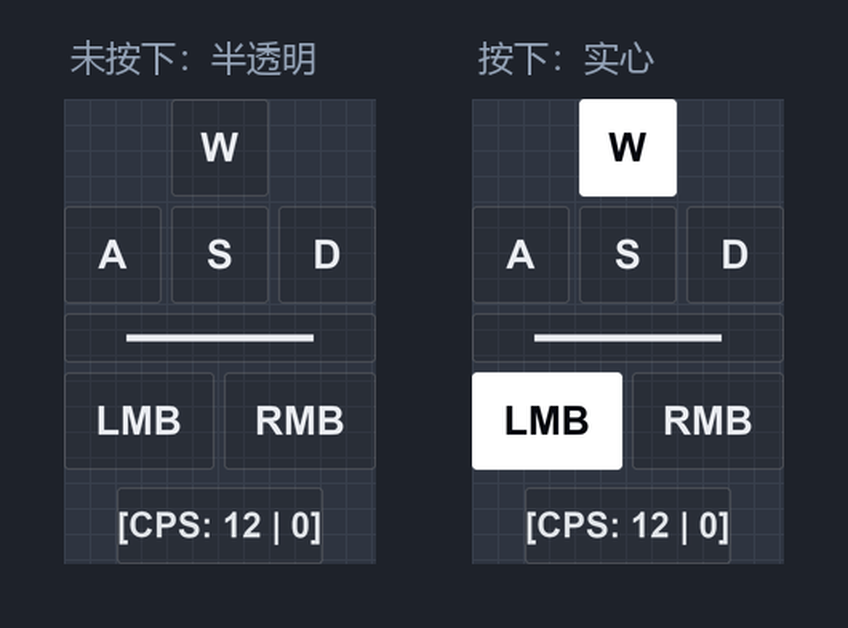

# 按键显示

一个常驻屏幕最上层的轻量级 **键位 / CPS 叠加层**（Windows）。

实时显示 W / A / S / D、空格、鼠标左右键的按下状态，以及左右键各自的
CPS（每秒点击次数）。基于 Win32 分层窗口实现**逐像素透明**：
未按下的键半透明、按下的键实心高亮，两者可以在同一帧里共存；
常驻模式下鼠标点击会**穿透**到下层窗口，不影响游戏操作。



## 特性

- **逐像素透明叠加**：分层窗口（`UpdateLayeredWindow`）+ 预乘 alpha，
  半透明与实心按键共存，窗口缝隙不挡点击
- **独立的输入采样线程**：1ms 周期轮询 + 系统定时器提精度，
  超短按下（1ms）的点击也不会漏计
- **置顶保持**：前台窗口切换或被其他置顶窗口覆盖时自动抢回最上层
- **移动模式**：托盘勾选后按住窗口即可拖动（其余位置的拖拽不受影响），
  位置始终被夹在显示器工作区内
- **系统托盘 + 设置面板**：27 项参数（尺寸 / 间距 / 圆角 / 颜色 /
  透明度 / 字体 / CPS 参数），全部为滑条、勾选、下拉、系统取色器等
  受控控件，改动即时生效
- **运行日志**：启动 / 退出（含原因）写入本地日志，便于排查
- 单文件源码（约 2000 行），除 Pillow、pystray 外无其他依赖

## 环境要求

- Windows 10 及以上
- Python 3.8+

## 运行

```bat
pip install -r requirements.txt
python 按键显示.py
```

## 打包成 exe

```bat
pip install pyinstaller
python build.py
```

生成 `dist\按键显示.exe`（单文件，约 16 MB，双击即用）。

## 操作

| 操作 | 方式 |
|---|---|
| 移动窗口 | 托盘勾选「移动模式」后，按住窗口左键拖动 |
| 打开设置 | 托盘右键 → 设置…（或双击托盘图标） |
| 退出 | 托盘右键 → 退出，或长按 `Ctrl + Alt + Q` 0.6 秒 |

## 配置

首次运行会在程序目录生成 `按键显示_配置.json`，所有参数都可以在
设置面板里调整；也可以直接编辑该文件后重启程序。运行日志在
`按键显示_运行日志.log`。

## 目录说明

```
按键显示.py      主程序（单文件源码）
build.py         一键打包脚本
按键显示.ico     程序图标
docs/preview.png README 预览图
```

## 许可

[MIT](LICENSE)
